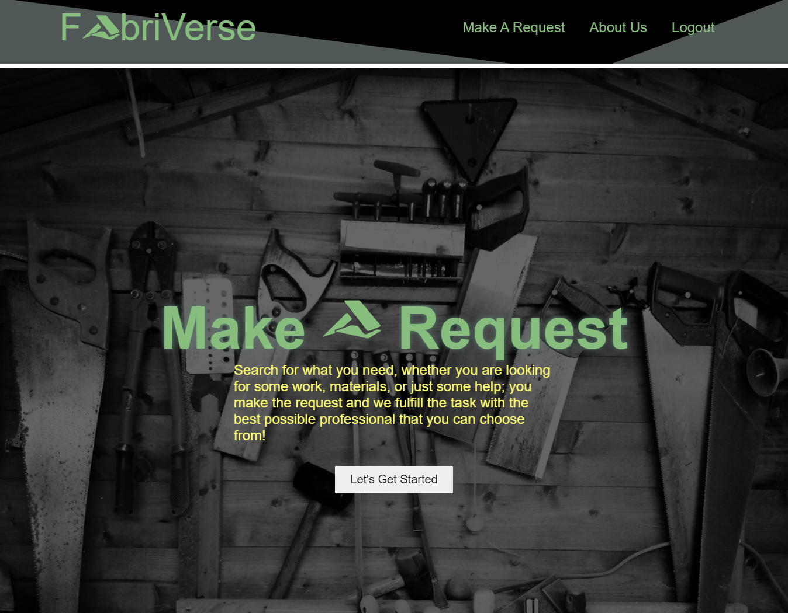

# Fabriverse

  ## Table of Contents

  * [About](#about)
  * [Build](#build)
  * [Installation](#installation)
  * [Demo](#demo)
  * [Contributing](#contributing)
  
  ## User Story

   Have you ever been curious about a DIY project you’d like to take up but don’t know where to begin. Perhaps you’ve already started one and found that you’re missing some key components that aren’t too easy to come by. Maybe you just need some help getting stuff done. Well what we aim to create with fabriverse is an all in one resource connection for any level of DIY enthusiasts. Our site will facilitate finding or providing products, labor, or resources. 

  ## About

  Our app can be thought of as a blog site where users can post to 3 different but connected categories. Users can either post to a product, service, or question category. Each of these categories is further divided into two further types for either requesting or providing. So as a user you could post a request for specific materials while also posting your availability to take on some carpentry work. Or you could post about an issue you’re having on a project and have a different user respond with their solution or a similar experience.

  ## Build

    - React 
    - Express
    - Mongodb/Mongoose
    - Graphql
    - JWT
    - Bootstrap

  ## Installation 
  
    - Git clone repo 
    - In terminal npm install
    - npm run seed (currently unavailable but when functional run)
    - npm run develop 

  ## Demo and Links

  

  ## Contributing 

  Pull requests are welcome. For major changes, please open an issue first to discuss what you would like to change.

  Please make sure to update tests as appropriate. 

<!-- need to check me query for why it doesn't query in graphql -->
<!--  -->